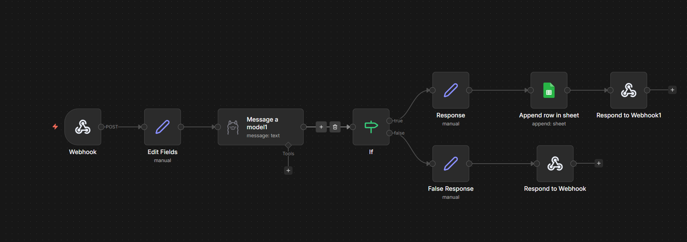
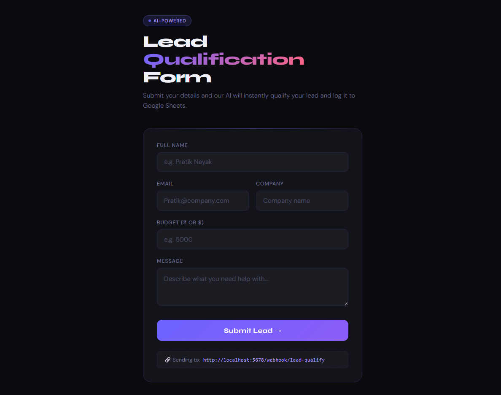

# AI Lead Qualification Agent (n8n)

An automated lead qualification system built using n8n that analyzes incoming leads and determines whether they are qualified using an AI model.

This workflow helps businesses improve lead filtering and sales efficiency by automatically identifying high-quality leads and reducing manual effort.

---

## Workflow Architecture

Below is the visual representation of the n8n workflow.

---

## Frontend Form

This project includes a custom-built frontend form that captures lead data and sends it to the n8n webhook for processing.

### Features of the Form

- Collects lead details (Name, Email, Company, Budget, Message)
- Sends data via POST request to webhook
- Displays real-time success or failure response
- Handles loading and error states

### How it Works

1. User fills the form  
2. Data is sent to the webhook endpoint  
3. Workflow processes the lead  
4. Response is shown instantly on UI  

---

# Overview

The workflow processes incoming lead data and determines whether a lead is qualified based on predefined criteria using an AI model.

Outcomes include:

- Qualified leads are stored for further action  
- Unqualified leads receive a response message  

The system receives data via a webhook, evaluates it using an AI model, and logs results in Google Sheets.

---

# Workflow Logic

The automation follows this logic:

1. Webhook Trigger  
   - Receives lead data from a frontend form or API request  

2. Process Lead Data  
   - Extracts and structures incoming data fields  

3. AI Evaluation  
   - Sends lead data to an LLM for qualification  
   - Enforces structured JSON output  

4. Qualification Decision  
   - If qualified → proceed to storage  
   - If not qualified → send rejection response  

5. Store Qualified Leads  
   - Saves lead details in Google Sheets  

6. Send Response  
   - Returns a success or rejection message via webhook  

---

# Features

- Event-driven automation using webhooks  
- AI-based lead qualification  
- Structured decision-making using LLM  
- Automated data storage in Google Sheets  
- Real-time response handling  
- Fully automated workflow built with n8n  

---

# Tech Stack

- n8n – Workflow automation platform  
- Ollama (phi3) – AI model for lead evaluation  
- Google Sheets – Lead data storage  
- Webhook – Workflow trigger  
- HTML + JavaScript – Frontend form  

---

# Example Qualification Logic

| Condition | Result |
|----------|--------|
| Budget > 1000 + Valid company + Clear intent | Qualified |
| Low budget or unclear intent | Not Qualified |

---

# Workflow Structure

Main nodes used in the workflow:

- Webhook Trigger  
- Set Node (Data Processing)  
- LLM Node (Lead Evaluation)  
- IF Node (Decision Logic)  
- Google Sheets Node (Data Storage)  
- Respond to Webhook Node  

---

# Use Case

This automation can be used by:

- Sales teams  
- Startups  
- SaaS businesses  
- Lead generation systems  

It helps businesses reduce manual lead filtering and automate qualification processes.

---

# How to Use

1. Install n8n  
2. Import the workflow.json file  
3. Connect your credentials:
   - Google Sheets  
   - Ollama (phi3 model)  

4. Update webhook endpoint in frontend  
5. Activate the workflow  
6. Submit lead data via form or API  

---

# Future Improvements

- Add authentication to webhook endpoints  
- Implement lead scoring system  
- Add retry and error handling  
- Store rejected leads separately  
- Build a dashboard for lead analytics  

---

# Author

Pratik Nayak  
MCA Student | Automation & AI Enthusiast  

Focused on building automation systems that reduce manual work and improve operational efficiency.
